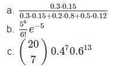
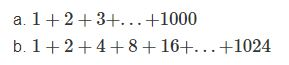

## PARTE 01

**1. Calcula los valores numéricos aproximados de**

{withd=80%}

**Resolución de los ejercicios**

1.a Resolución
```{r message=FALSE, warning=FALSE}
ejerc01 <- function(a=0.3, b=0.15, c=0.2, d=0.8, e=0.5, f=0.12){
  operacion <- ((a*b)/((a*b)+(c*d)+(e*f)))
  return(operacion)
}
ejerc01()
```


1.b Resolución 
```{r message=FALSE, warning=FALSE}
parteb <- function(a, b){
  oper03 <- ((a^b)/(factorial(b)))*exp(-a)
  return(oper03)
}
parteb(a=5, b=6)
```

1.c Resolución
```{r message=FALSE, warning=FALSE}
N<-20
n<-7
fact01<-factorial(N)/(factorial(n)*(factorial(N-n)))
res<-fact01*(0.4**7)*(0.6**13)
```

**2. Realizar la siguiente suma**

{withd=80%}

**Resolución de los ejercicios**

2.a Resolución 
```{r message=FALSE, warning=FALSE}
a <- c(1:1000)
sum(a)

```

2.b Resolución
```{r message=FALSE, warning=FALSE}
ejerc02 <- function(a1, r, n){
  oper02 <- a1*r^(n-1)
  return(oper02)
}
ejerc02(a1=1, r=2, n=1:11)

suma <- ejerc02(a1=1, r=2, n=1:11) #Anidamos los resultados
sum(suma)
```

**3. El vector grupo representa el grupo al que pertenece una serie de alumnos**

3.a ¿Cuántos elementos tiene?

3.b ¿En qué posiciones del vector está la letra “A”?

**Resolución de los ejercicios**

3a. Resolución
```{r message=FALSE, warning=FALSE}
load("ei1012-1516-la-s1-datos.RData")
grupo
length(grupo)
```

3b. Resolución
```{r message=FALSE, warning=FALSE}
which(grupo == "A")
```


**4. El vector nota representa la nota de un examen de los alumnos que están en los grupos del vector grupo.**

4.a ¿Cuanto suman todas las notas?

4.b ¿Cual es la media aritmética de todas las notas?

4.c ¿En qué posiciones están las notas mayores de 7.0?

4.d Visualiza las notas ordenadas de mayor a menor

4.e ¿En qué posición está la nota máxima?

**Resolución de los ejercicios**

4a. Resolución
```{r message=FALSE, warning=FALSE}
nota
sum(nota)
```

4b. Resolución
```{r message=FALSE, warning=FALSE}
mean(nota)
```

4c. Resolución
```{r message=FALSE, warning=FALSE}
which(nota > 7)
```

4d. Resolución
```{r message=FALSE, warning=FALSE}
head(nota[order(-nota)],10)
```

4e. Resolución
```{r message=FALSE, warning=FALSE}
which(nota == 7.7)
```

**5. A partir de los vectores grupo y nota definidos.**

5.a las notas de los 10 primeros alumnos del vector

5.b ¿Cuántos alumnos hay del grupo C?

5.c ¿Cuántos alumnos han aprobado?

5.d ¿Cuántos alumnos del grupo B han aprobado?

5.e ¿Qué porcentaje de alumnos del grupo C han aprobado?

5.f ¿De qué grupos son la máxima y mínima notas de toda la muestra?

5.g Nota media de los alumnos de grupo A y B, juntos, considerando sólo a los que han aprobado

**Resolucion de los ejercicios**

5a. Resolución 
```{r message=FALSE, warning=FALSE}
dplyr::tibble(grupo1 = grupo, nota1 = nota)
primeros_10 <- head(dplyr::tibble(grupo1 = grupo, nota1 = nota),10)
sum(primeros_10$nota1)
```

5b. Resolución 
```{r message=FALSE, warning=FALSE}
library(dplyr)
Alum_notas <- dplyr::tibble(grupo1 = grupo, nota1 = nota)
Alum_notas %>% 
  dplyr::select(grupo1) %>% 
  dplyr::filter(grupo1 == "C") %>% 
  dplyr::summarise(length(grupo1))
```


5c. Resolución 
```{r message=FALSE, warning=FALSE}
Alum_notas <- dplyr::tibble(grupo1 = grupo, nota1 = nota)
Alum_notas %>% 
  dplyr::filter(nota1 >=5) %>% 
  dplyr::summarise(length(nota1))
```


5d. Resolución 
```{r message=FALSE, warning=FALSE}
Alum_notas <- dplyr::tibble(grupo1 = grupo, nota1 = nota)
Alum_notas %>% 
  dplyr::filter(grupo1 == "B" & nota1 >= 5.0) %>%
  dplyr::summarise(length(nota1))
```


5e. Resolución 
```{r message=FALSE, warning=FALSE}
Alum_notas <- dplyr::tibble(grupo1 = grupo, nota1 = nota)
porcentaje <- Alum_notas %>% 
  dplyr::filter(grupo1 == "C" & nota1 >=5) %>%
  dplyr::summarise(length(nota1))

alumC <- Alum_notas %>% 
  dplyr::filter(grupo1 == "C") %>% 
  dplyr::summarise(length(nota1))

((porcentaje/alumC)*100)
```


5f. Resolución
```{r message=FALSE, warning=FALSE}
Alum_notas <- dplyr::tibble(grupo1 = grupo, nota1 = nota)

max <- Alum_notas %>%
  dplyr::filter(nota1 == max(nota1))

min <- Alum_notas %>%
  dplyr::filter(nota1 == min(nota1))
```


5g. Resolución
```{r message=FALSE, warning=FALSE}
Alum_notas <- dplyr::tibble(grupo1 = grupo, nota1 = nota)

#Utilizando  xor
Alum_notas %>% 
  dplyr::filter(xor(grupo1 == "A" & nota1 >=5, grupo1 == "B" & nota1 >= 5)) %>% 
  dplyr::summarise(mean(nota1)) 

#Utilizando o
Alum_notas %>% 
  dplyr::filter((grupo1 == "A" & nota1 >=5) | (grupo1 == "B" & nota1 >= 5)) %>% 
  dplyr::summarise(mean(nota1))
```


**6. Calcula el percentil 66 de las notas de todos los alumnos, y también de los alumnos del grupo C.**

**Resolución**
```{r message=FALSE, warning=FALSE}
Alum_notas <- dplyr::tibble(grupo1 = grupo, nota1 = nota)
Alum_notas %>%
  dplyr::select(nota1) %>% 
  dplyr::summarise(quantile(nota1, 0.66)) #sacando quantil 0.66

Alum_notas %>% 
  dplyr::filter(grupo1 == "C") %>% 
  dplyr::summarise(quantile(nota1, 0.66)) #para lo de grupo C
```

**7. Un alumno tiene una nota de 4.9. ¿Qué porcentaje, del total de alumnos, tiene una nota menor o igual que la suya? ¿Y qué porcentaje tiene una nota mayor o igual que la suya?**

**Resolución**
```{r message=FALSE, warning=FALSE}
Alum_notas <- dplyr::tibble(grupo1 = grupo, nota1 = nota)
menor_4.9 <- Alum_notas %>% 
  dplyr::filter(nota1 <= 4.9) %>%
  dplyr::summarise(length(nota1))
((menor_4.9/nrow(Alum_notas))*100) #sacando porcentajes

mayor_4.9 <- Alum_notas %>% 
  dplyr::filter(nota1 >= 4.9) %>%
  dplyr::summarise(length(nota1)) 
((mayor_4.9/nrow(Alum_notas))*100)
```

**8. Realiza el gráfico de diagramas de caja de las notas de cada grupo, para poder comparar el nivel de cada uno de ellos.**

**Resolución**
```{r message=FALSE, warning=FALSE}
library(ggplot2)
Alum_notas <- dplyr::tibble(grupo1 = grupo, nota1 = nota)
Alum_notas %>% ggplot(mapping = aes(x = grupo1, y = nota1)) +
  geom_boxplot()
```

**9. Si la variable conc recoge la concentración de plomo (en ppm) en el aire de cierta zona durante un día completo**

9.a ¿Cuál ha sido la concentración máxima?

9.b ¿En cuántos de los muestreos se ha superado la concentración de 40.0 ppm?

9.c ¿Cuál ha sido la concentración media del día?

9.d ¿Cuáles fueron las 10 mediciones más bajas del día?

9.e Si la primera medida fue a las 00:00. ¿A qué hora del día se alcanzó la concentración máxima?

**Resolución de los ejercicios**

9a. Resolución
```{r message=FALSE, warning=FALSE}
concentrac <- dplyr::tibble(values = conc)
concentrac %>% 
  dplyr::summarise(max(values))
```

9b. Resolución
```{r message=FALSE, warning=FALSE}
concentrac %>%
  dplyr::filter(values > 40.0) %>%
  dplyr::summarise(length(values))
```

9c. Resolución
```{r message=FALSE, warning=FALSE}
concentrac %>% 
  dplyr::summarise(mean(values))
```

9d. Resolución
```{r message=FALSE, warning=FALSE}
medicio_10 <- concentrac %>% 
  dplyr::arrange(values)
head(medicio_10, 10)
```

9e. Resolución
```{r message=FALSE, warning=FALSE}
length(conc)
tiempo_recojo <- 23/length(conc) #tiempo de recojo de cada concentracion
which(conc == max(conc)) #ocupacion dd la maxima concentracion
produc <- tiempo_recojo * which(conc == max(conc))
produc
```

