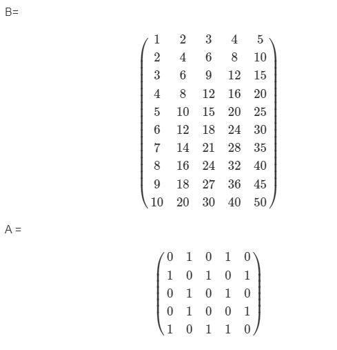

## PARTE02

**1. Graficar los puntos (1,1),(2,4),(3,6)(4,8),(6,36),(7,49),(8,61),(9,81),(10,100) en un plano utilizando RStudio** 

1. Resolución 
```{r message=FALSE, warning=FALSE}
part_A <- c(1:10)
part_B <- c(1, 4, 6, 8, 25, 36, 49, 61, 81, 100)
plot(part_A, part_B)
```

**2. Ingresar la matriz A en Rstudio**

$$\ A = \begin{pmatrix}\ 1 & \ 2 & \ 3 \\ \ 2 & \ 4 & \ 6 \\ \ 3 & \ 6 & \ 9 \\ \ 4 & \ 8 & \ 12 \end{pmatrix}$$
2. Resolución
```{r message=FALSE, warning=FALSE}
A <- c(1:4, 2*(1:4), 3*(1:4))
matriz_A <- matrix(A, nrow = 4, ncol = 3)
matriz_A
```

**3. Ingresar la matriz identidad de tamaño 3**

$$\ I = \begin{pmatrix}\ 1 & \ 0 & \ 0\\ \ 0 & \ 1 & \ 0 \\ \ 0 & \ 0 & \ 1 \end{pmatrix}$$


3. Resolución
```{r message=FALSE, warning=FALSE}
matriz_I <- diag(3)
matriz_I
```

**4. Crea una función que cree una matriz nula ingresando las dimensiones**

4. Resolución
```{r message=FALSE, warning=FALSE}
Matriz_nula <- function(f,c){
  matrix(0, nrow = f, ncol = c)
}
Matriz_nula(5,6)
```

**5. Modificar la matriz diag(4), para que se parezca a la matriz B**

$$\ A = \begin{pmatrix}\ 0 & \ 0 & \ 0 & \ 0 \\ \ 0 & \ 2 & \ 0 & \ 0 \\ \ 0 & \ 0 & \ 3 & \ 0 \\ \ 0 & \ 0 & \ 0 & \ 4 \end{pmatrix}$$
5. Resolución
```{r message=FALSE, warning=FALSE}
diag(4)
mod_A <- c(-1, 1, 2, 3)
mod_B <- diag(mod_A,nrow = 4)
modAB <- mod_B + diag(4)
modAB
```

**6. Obtener la matriz transpuesta de A (ejercicio 2)**

6. Resolución
```{r message=FALSE, warning=FALSE}
Transpuesta <- t(matriz_A)
Transpuesta
```

**7. Realizar las siguientes operaciones A + B, A - B, 3B y A*B**
7. Resolución
```{r message=FALSE, warning=FALSE}
#matriz_A + modAB # Esta operacion no se puede realizar


```

**8. Crea una función para calcular P^6**
$$\ P = \begin{pmatrix}\ 1 & \ 2 & \ 3\\ \ -2 & \ 4 & \ -2 \\ \ 1 & \ 0 & \ 1 \end{pmatrix}$$
8. Resolución
```{r message=FALSE, warning=FALSE}
matriz_p <- c(1, -2, 1, 2, 4, 0, 3, -2, 1)
matriz_p <- matrix(matriz_p, nrow = 3)

funcion <- function(potencia){
  potencia^6
}
funcion(matriz_p)
```

**9. Resolver el sistema de ecuaciones**

3x - y + z = -1

9x - 2y + z = -9

3x + y - 2Z = -9

9. Resolución
```{r message=FALSE, warning=FALSE}
A <- c(3, 9, 3, -1, -2, 1, 1, 1, -2)
B <- c(-1, -9, -9)

matr_A <- matrix(A, nrow = 3)
matr_B <- matrix(B, ncol = 1)

inversa <- solve(matr_A) #inversa de la matriz
inversa %*% matr_B 
```

**10. Utilizando la ayuda de R, investigue para qué sirven las funciones eigen() y det()**

10. Resolución
```{r message=FALSE, warning=FALSE}

eigen(cbind( 1, 3:1, 1:3)) #Determina los autovalores

Z <- matrix(c(4,54,2,4,8,4,2,4,8),nrow = 3,ncol = 3) #Para los determinantes
det(Z)
```

**11. Considerando las matrices**

{withd=80%}

**Calcular (A * B) - A * (B^t)**

11. Resolución del ejercicio
```{ message=FALSE, warning=FALSE}
mat_B <- c(1:10, 2*(1:10), 3*(1:10), 4*(1:10), 5*(1:10))
matriz_B <- matrix(mat_B, nrow = 10)

mat_A <- c(0, 1, 0, 0, 1, 1, 0, 1, 1, 0, 0, 1, 0, 0, 1, 1, 0, 1, 0, 1, 0, 1, 0, 1, 0)
matriz_A <- matrix(mat_A, nrow = 5)

matriz_A %*% matriz_B
```


**12. B = (((X^t) * (x))^-1) * (x^t)(y)**

$$\ x = \begin{pmatrix}\ 1 & \ 1 \\ \ 1 & \ -1 \\ \ 1 & \ 0 \\ \ 1 & \ 1 \\ \ 1 & \ 2 \end{pmatrix}$$
$$\ y = \begin{pmatrix}\ 0 \\ \ 0 \\ \ 1 \\ \ 1 \\ \ 3 \end{pmatrix}$$

12. Resolución 
```{ message=FALSE, warning=FALSE}
X <- matrix(c(1,1,1,1,1,1,-1,0,1,2),nrow = 5, ncol = 2)
Y <- matrix(c(0,0,1,1,3),nrow = 5, ncol = 1)

Beta <- ((t(X)%*%X)^(-1))%*%t(X)%*%Y
Beta
```

**13. Corre el siguiente código para cargar los vectores year y co2 en memoria**

```{r message=FALSE, warning=FALSE}
data(co2)
means = aggregate(co2, FUN=mean)
year = as.vector(time(means))
co2 = as.vector(means)
```

El vector co2 contiene medidas de Co2 en la atmósfera, en unidades de ppm, durante el periodo 1959-1997. El vector year contiene sus años correspondientes.

a. Calcular un vector de diferencias de Co2 entre años consecutivos, que sería:
ejemplo:

Co2 en  1960 menos el Co2 de 1959

Co2 en  1961 menos el Co2 de 1960

b. Crear un plot con lineas y puntos mostrando las diferencias consecutivas de Co2 en función del tiempo (1960, 1961, etc…), en negrita

c. La diferencia de concentración de Co2 entre 2020 y 2019 fue igual a 2.64. Agregar un punto rojo representando esa diferencia al plot ya creado (usar una forma diferente, como pch=4)

**Resolucion de los ejercicios**

13a. Resolución
```{r message=FALSE, warning=FALSE}
library(dplyr)
data(co2)
means = aggregate(co2, FUN=mean)
year = as.vector(time(means))
co2 = as.vector(means)

datos <- data.frame(anio = year, nivel =round(co2,1))
datos <- datos %>% 
  dplyr::mutate(rest = c(nivel[2:39], 0)) %>% 
  dplyr::mutate(difer = rest - nivel)
```

13b. Resolución
```{r message=FALSE, warning=FALSE}
result <- datos[1:38, 4]

plot(year[2:39], result, xlab = "años", ylab = "valores de concentración", 
     main = "Concentración de Co2 por años", type = "o", pch = (16), col = "black")
```

**14**

a. Lee el archivo rainfall.csv como un data.frame

b. Calcula e imprime un vector con los nombres de las estaciones donde al menos uno de
los meses tiene una precipitación superior a 180mm.

**Resolución de los ejercicios**

14a. Resolución
```{r message=FALSE, warning=FALSE}
df01 <- read.csv("https://raw.githubusercontent.com/ryali93/ProgramacionR/master/data/rainfall.csv")

df02 <- data.frame(df01)
is.data.frame(df02)
```

14b. Resolución
```{r message=FALSE, warning=FALSE}
library(dplyr)
df01 <- read.csv("https://raw.githubusercontent.com/ryali93/ProgramacionR/master/data/rainfall.csv")

df02 <- dplyr::tibble(df01)
df02 <- df02 %>%
  dplyr::select(name, everything()) %>% 
  dplyr::filter(sep >=180| 
                oct >=180| 
                nov >=180| 
                dec >=180| 
                jan >=180| 
                feb >=180| 
                mar >=180| 
                apr >=180|
                may >=180) %>% 
  dplyr::select(name)
df02

```


